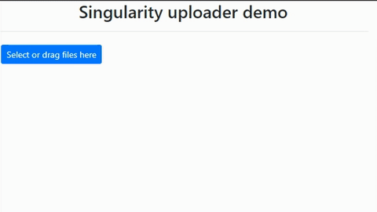

# Plugin overview
A simple file uploader

* Does not require any libraries
* Suports uploading of large files via multiple smaller-sized data chunks (this also allows bypassing the php upload limit)
* Includes server-side handling script (PHP)



# Usage
<div style="color:red;">Warning! Altough this plugins includes some basic "security" measures, you should implement your own if you intend to use this in a project! I'm not responsible for any security breaches you may have!</div>

<h4>JS Plugin</h4>

The plugin uses Bootstrap 4 and font-awesome styles, but you may change it to whatever suits your own project.

```javascript
// 1. Include stylesheet <link rel="stylesheet" href="singularityUploader.min.css">
// 2. Include script file <script src="singularityUploader.min.js"></script>
// 3 . Create an instance 
  singularityUploader.create('targetId', {
    transferDestination: 'uploadFiles.php' // NOTE: This will handle our uploads
});
```

Available options:

```javascript
let options = {
transferDestination:'', // NOTE: Script that will handle the uploads
                allowedFileExtensions:[], // NOTE: Accepted file extensions
                maxFileSize:null, // NOTE: Max file size in bytes
                maxConcurrentTransfers: 5, // NOTE: Max concurrent chunk transfers per file
                maxFileChunkSize: 2097152, // NOTE: bytes per data chunk
                multipleFiles:false, // NOTE: Single/multiple file upload
                sessionName: 'singularityUpload', //NOTE: The session name that the php script will use to store uploaded files
                maxRetries: 3, // NOTE: Max number of chunk retries
                success:null, // NOTE: Success callback - called after the last file has been uploaded and success confirmation from handling script is received
                error:null,
                buttons: [ // NOTE: Can be extended to include custom buttons
                    {
                        text: 'Clear Files',
                        attributes:
                            {
                                'class':'btn btn-primary btn-sm _sg-uploader-button _sg-uploader-actionButton',
                                'onclick': function(event)
                                {
                                    event.preventDefault();
                                    uploader.clearTransferQueue();
                                }
                            }
                    },
                    {
                        text: 'Upload',
                        attributes:
                            {
                                'class':'btn btn-primary btn-sm _sg-uploader-button _sg-uploader-actionButton',
                                'onclick': function(event)
                                {
                                    event.preventDefault();
                                    var progressBar = document.getElementById('_sg-uploader-fileProgressContainer' + instanceId);

                                    if(progressBar)
                                    {
                                        progressBar.style.display = 'inline-flex';
                                    }

                                    uploader.initTransfer();
                                }
                            }
                    }
                ],
                selectFilesText: 'Select Files', // NOTE: Select files button text
                dropAreaText: 'Drop files here' 
}
```

<h4>Server-side</h4>

```php
$uploadSession = new UploadManager();

// NOTE: Configure settings per upload session
$uploadSession->getUploadSessionConfig('singularityUpload') // NOTE: The session name should reflect the 'sessionName' js option or files will not be stored correctly
                ->setUploadPath(__DIR__.DIRECTORY_SEPARATOR.'uploads')
                ->setAlowMultipleFiles(true) // NOTE: This should reflect what was set in the js options so that files are not lost
                ->setAllowedFileExtensions(['doc', 'docx']) // NOTE: This should reflect what was set in the js options so that files are not lost
;

$uploadSession->handleUploads(); // NOTE: Start listening for incoming files
```
